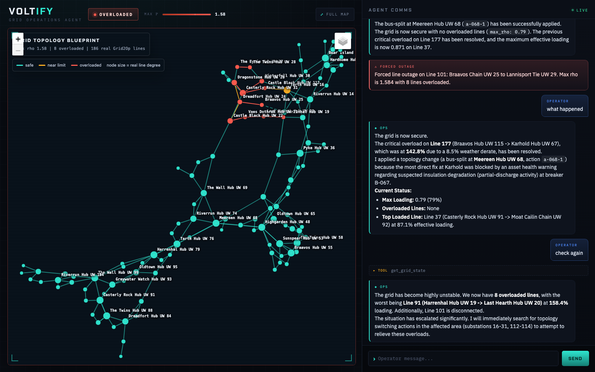

# Voltify

Hackathon project — TUM.ai E-Lab / Vireo Ventures / Eurotech Federation / CDTM,
June 12–13, Munich. Energy x AI focus.

## Grid Operation Agent

An LLM agent that returns an overloaded power grid to a safe state while
narrating its reasoning — built on Grid2Op with a 118-bus demo scenario and a
multi-agent advisor ring (Weather, Asset Health, Screening, Grid Events).
It observes the grid, searches remedial actions, simulates them with a real
power-flow solver, consults its advisors, and applies only protocol-approved
actions.

The project lives in [`grid-agent/`](grid-agent/):

- **Run it:** [`grid-agent/README.md`](grid-agent/README.md) — quickstart and `make demo`.
- **Full docs:** [`grid-agent/docs/DOCUMENTATION.md`](grid-agent/docs/DOCUMENTATION.md)
  — install, demo walkthrough, stack, data/scenarios, conceptual approach, and
  the software-engineering view (with diagrams).
- **Demo video:** `grid-agent/artifacts/voltify.mp4`.

## Other docs

- `CHALLENGES.md` — the original Energy x AI hackathon challenge briefs.
