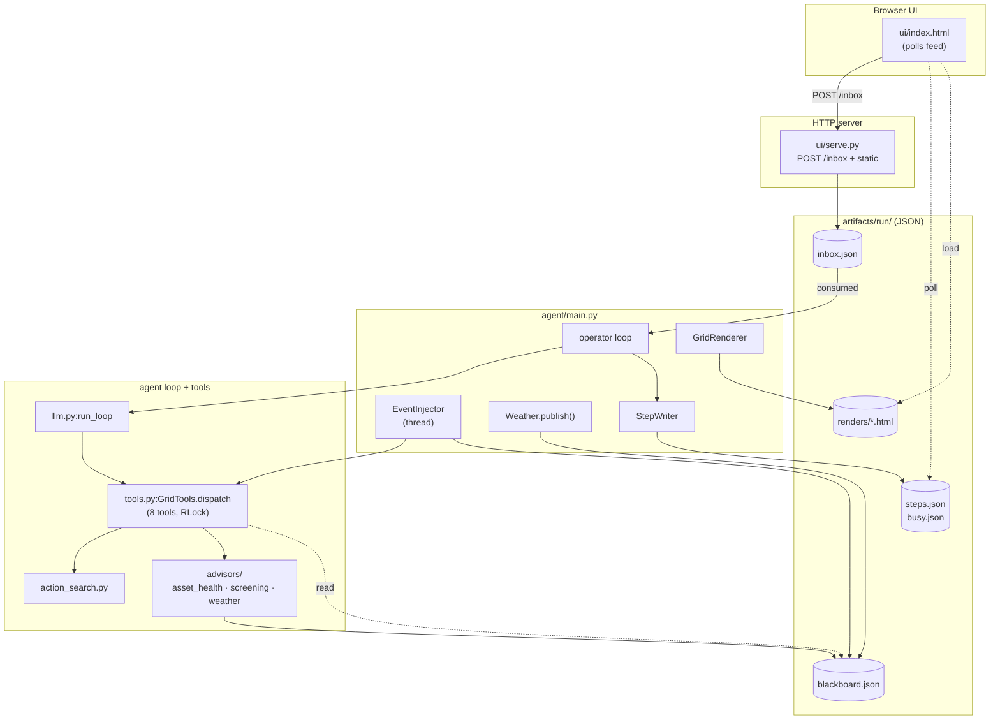
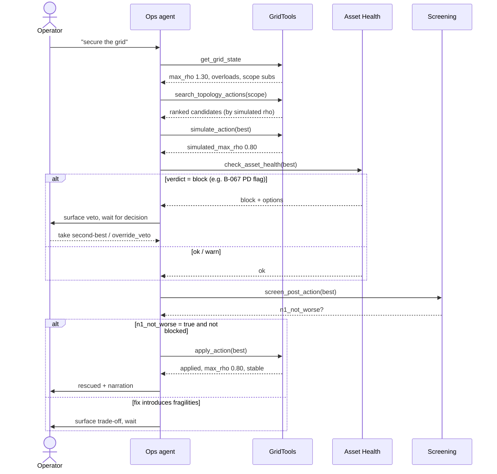

# Grid Operation Agent — Documentation

An LLM agent that returns an overloaded power grid to a safe state while
narrating its reasoning. Built on Grid2Op with a 118-bus demo scenario and a
multi-agent advisor ring (Weather, Asset Health, Screening, and a Grid Events
injector). The agent observes the grid, finds remedial topology/redispatch/
curtailment actions, simulates them with a real power-flow solver, consults its
advisors, and applies only protocol-approved actions.

> Scope note: this is a 24h hackathon build. Numbers, datasets, and asset
> registers are demo stand-ins; the engineering patterns are real. See
> §5 for the conceptual framing and §6 for the software-engineering view.

---

## 1. Installation and Requirements

### Runtime

| Requirement | Value |
|-------------|-------|
| Python | 3.12 (uv-managed) |
| OS | macOS / Linux (developed on macOS / darwin) |
| Dependency manager | [`uv`](https://docs.astral.sh/uv/) |
| Build tool | `make` |
| Browser | any modern browser for the demo UI |

Python version matters. The system `python3` (3.9) is too old and Homebrew
3.14 is too new for the scientific wheels (`numpy<2`, `grid2op`, `pandapower`).
Use a uv-managed 3.12 interpreter.

### Python dependencies

From `requirements.txt`:

```text
grid2op        # power-grid RL/simulation environment
pandapower     # power-flow backend used by Grid2Op
numpy<2        # pinned: grid2op/pandapower wheels expect the 1.x ABI
matplotlib     # render/plot support
plotly         # interactive plots in spike scripts
openai         # OpenAI-compatible chat-completions client (talks to a local endpoint)
pytest         # test runner
ruff           # linter
```

Optional performance dependency: **`numba`** (not pinned in
`requirements.txt`). Grid2Op/PandaPower run noticeably faster with `numba`
installed; without it the power-flow loop falls back to pure NumPy. Install it
into the same venv if screening/search feels slow.

### LLM endpoint

The agent talks to an **OpenAI-compatible chat-completions endpoint** — it does
not call any hosted API by default. Configured in `agent/config.py`:

```python
LLM_BASE_URL = "http://localhost:8003/v1"
LLM_MODEL    = "mlx-community/gemma-4-26B-A4B-it-qat-4bit"
```

The reference setup is a **local MLX model server** on port 8003 (Apple
Silicon). Any endpoint that speaks the OpenAI tool-calling protocol works —
point `LLM_BASE_URL`/`LLM_MODEL` at it. The API key is hard-coded to the dummy
value `"local"` because a local server ignores it.

The system stays alive without the model: every advisor narration has a
deterministic template fallback (`agent/advisors/voice.py`), so a down or slow
endpoint degrades narration quality but does not crash the demo. The Operations
agent loop, however, **does** require a working tool-calling endpoint — it is
the model that drives the rescue.

### Known setup caveats

- Python 3.12 specifically — avoid 3.9 (too old) and 3.14 (no wheels).
- `numpy<2` is a hard pin; do not let a transitive dependency pull NumPy 2.x.
- First Grid2Op run downloads/initializes the dataset into `data_grid2op/`;
  the demo dataset is already checked in (see §4).
- A free TCP port `8000` is required for the UI (`make demo` aborts if busy —
  override with `make ui PORT=8001`).

---

## 2. Trying Out the Demo

### Quickstart from a fresh clone

```bash
cd grid-agent

# 1. Create the venv and install deps (uv-managed 3.12)
uv venv --python 3.12 .venv
uv pip install --python .venv/bin/python -r requirements.txt

# 2. Smoke-check the test suite
make test            # == .venv/bin/python -m pytest tests/ -v

# 3. Start the demo (UI server + agent in inbox mode + event injector)
make demo
```

Then open:

```text
http://localhost:8000/ui/index.html
```

`make demo` starts the static UI server (`ui/serve.py`) and runs the agent with
`--inbox --inject`, so messages typed into the web input are consumed by the
agent and the autonomous event injector perturbs the grid between turns.

### Useful separate targets

```bash
make ui      # serve only the web UI (static files + /inbox POST endpoint)
make agent   # run only the inbox agent (--inbox --inject)
make test    # run the full pytest suite
```

### Interactive modes

The runtime has a few independent moving parts (see §6 for wiring):

- **Static UI server** (`ui/serve.py`) — serves `ui/index.html` and exposes a
  single `POST /inbox` endpoint. The UI polls `artifacts/run/steps.json` and
  `busy.json` to render the live feed.
- **Inbox operator messages** — the web input writes operator text (or a
  structured *decision*) into `artifacts/run/inbox.json`; the agent's `Inbox`
  consumer (`agent/main.py`) picks them up one at a time.
- **Agent loop** — the Operations agent runs an OpenAI tool-calling loop
  (`agent/llm.py:run_loop`) over the grid tools.
- **Event injector** (optional, `--inject`) — a daemon thread that fires random
  world events (forced outages, load drift, weather derates) so the grid lives
  on its own between operator turns.

You can run the agent directly without `make`:

```bash
.venv/bin/python -m agent.main            # interactive console, no UI
.venv/bin/python -m agent.main --inbox    # read operator messages from the UI inbox
.venv/bin/python -m agent.main --inbox --inject            # + autonomous events
.venv/bin/python -m agent.main --no-weather                # skip the opening Weather bulletin
.venv/bin/python -m agent.main --inject --inject-period 30 # faster event cadence (seconds)
```

### Expected demo arc

1. **Healthy grid** — agent connects, Weather posts an opening derate bulletin,
   the grid renders mostly green.
2. **Line outage / overload** — a forced outage (operator-injected or from the
   event injector) trips a line; flows redistribute and several lines go red
   (`rho > 1.0`).
3. **Topology action search** — the agent scopes the substations around the
   overload and searches unitary bus-split actions, ranking candidates by the
   resulting max line loading.
4. **Advisor checks** — for the chosen candidate the agent calls
   `check_asset_health` (breaker/condition veto) and `screen_post_action`
   (post-action N-1 screening). It applies only when N-1 is *not worsened* and
   Asset Health does not block.
5. **Action application** — `apply_action` steps the real grid and runs a short
   stability check.
6. **Rescued state** — max loading drops back below 1.0; the render goes green
   and the agent narrates why the chosen (cheap, switching) fix beat the
   alternatives.

The checked-in demo runs the **crisis-at-open** scenario (`scenarios/arc_118.json`,
verified 2026-06-12): the 118-bus env opens *already* in crisis — no injected
outage needed — with crisis line **177** (between substations 115 and 67) at
max `rho ≈ 1.30`, and do-nothing blacks the grid out after **4 steps**. The
agent scopes substations `[64, 67, 68, 80, 115]`, simulates **88 of 72,107**
unitary actions in ~3 s, and the bus-split at **substation 67** brings max `rho`
to **≈ 0.80** with zero overloads, stable for the 20 checked steps. See §4 for
the full scenario set (including the asset-veto and crew-on-site branches).

A cut screen recording of the full arc is checked in at
**`artifacts/voltify.mp4`**.

### Talking to the agent — example prompts

You drive the agent with plain operator messages in the UI input (or stdin).
The following are **verified** demo prompts (`scenarios/crib_sheet.md`) — each
exercises a different capability:

| Operator message | What the agent does |
|------------------|---------------------|
| `Shift start. Please check the grid and secure it if needed.` | Full autonomous rescue: inspect → scope → search 88 actions → simulate → asset/N-1 checks → apply bus-split at sub 67 → re-verify. Narrates each step. |
| `Why not redispatch instead?` | Answers from the cost ladder and *measured* switching result; states redispatch was not simulated this run rather than inventing numbers (the honesty point). |
| `Shift start … Substation 67 is unavailable, maintenance crew on site.` | Translates the plain-language constraint into `exclude_substations=[67]`, finds the next-best fix `a-068-1` at sub 68, and says it did so. |
| `Do not override the veto. Take the second-best at another substation.` | On an Asset Health **block**, respects the veto: re-searches excluding the vetoed substation and applies the clean alternative. |
| `{"kind":"decision","ref":"<action_id>","choice":"override_veto","note":"accepting asset risk, signed"}` | Structured operator decision: clears the asset block so the agent may apply the originally-vetoed action. |

These show the agent is **agentic**, not a fixed script: it works the full
remedial sequence without pausing between steps, escalates the cost ladder
(switching → redispatch → curtailment) on its own, and only stops for a genuine
human decision (an asset block or an N-1-fragile fix). Free-text constraints
become tool arguments; structured `decision` messages drive the veto/override
protocol.

> **Further agentic potential (aspirational — not all built today).** The same
> tool-loop + advisor-ring pattern extends naturally; these prompts illustrate
> the direction, tied to §5 *Future work*, and are **not** all supported by the
> current toolset:
>
> - `"Walk me through the worst contingency you found and whether a recovery action exists."`
>   — needs the recovery-action search §5 flags as not-yet-implemented.
> - `"Keep the grid secure for the next hour and log every action."` — a
>   standing-objective / autonomous-watch mode over the event injector.
> - `"Compare the topology fix against redispatch on cost and N-1 resilience."`
>   — quantitative multi-lever trade-off (today redispatch is qualitative).
> - `"Crew clears sub 67 in 40 min — replan when it's back."` — time-aware
>   constraints with a scheduler.
>
> Treat these as a roadmap of where the architecture points, not a feature list.

### Troubleshooting

| Symptom | Likely cause | Fix |
|---------|--------------|-----|
| `Port 8000 is already in use` | stale UI server | stop it, or `make ui PORT=8001` |
| Agent never acts / hangs on first turn | LLM endpoint unreachable | check `LLM_BASE_URL`; start the local model server on `:8003` |
| Narration looks templated/terse | LLM endpoint down (advisor fallback) | acceptable for advisors; verify endpoint for the Ops loop |
| `make demo` errors on dataset | Grid2Op data missing | confirm `data_grid2op/l2rpn_neurips_2020_track2_small/` exists (§4) |
| Wrong Python / import errors on numpy | NumPy 2.x or Python 3.9/3.14 | rebuild venv with uv 3.12, keep `numpy<2` |
| Search/screening very slow | `numba` not installed | `uv pip install --python .venv/bin/python numba` |
| Empty/old feed in the UI | `artifacts/run/` stale | `make clean-run` (or just rerun `make demo`, which cleans it) |

---

## 3. Technical Stack

| Layer | Technology |
|-------|------------|
| Language / runtime | Python 3.12 (uv-managed venv) |
| Grid simulation | **Grid2Op** (`l2rpn_neurips_2020_track2_small`, 118-bus MultiMix) over a **PandaPower** power-flow backend |
| LLM integration | OpenAI-compatible **chat completions + tool calling** (`openai` SDK pointed at a local endpoint) |
| Frontend | Static HTML/JS UI (`ui/index.html`) + **Leaflet**-based per-state grid renders generated server-side |
| Coordination/data | File-backed JSON: inbox, step feed, blackboard, busy flag, render files |
| Testing / linting | **pytest** + **ruff** (and `mypy` per repo standard) |
| Scripts / benchmark | One-off spike scripts (`scripts/`) and an agent-vs-baseline benchmark (`bench/`) |

**Project layout** (top level of `grid-agent/`):

```text
agent/        Runtime agent, tools, prompts, advisor backends, renderer
bench/        Benchmark + N-1 screening utilities
data/         Small checked-in inputs (ENTSO-E load XML, 118-bus layout)
data_grid2op/ Local Grid2Op dataset (the 118-bus MultiMix environment)
docs/         Product / spec / planning / handoff documents (this file)
scenarios/    Scripted demo scenario data (assets, weather, arc, second-best)
scripts/      One-off spike and verification scripts
tests/        Pytest suite (mirrors agent modules)
ui/           Static demo UI and local server
artifacts/    Checked-in demo outputs, screenshots, video; run/ is regenerated
```

**Data / artifact formats:**

- `artifacts/run/inbox.json` — operator messages / decisions (UI → agent).
- `artifacts/run/steps.json` — append-only event feed (agent → UI).
- `artifacts/run/blackboard.json` — advisor constraints, vetoes, screening
  verdicts, decisions.
- `artifacts/run/busy.json` — "agent thinking" flag driving the UI ticker.
- `artifacts/run/renders/*.html` — per-state Leaflet grid blueprints.
- `artifacts/benchmark_118.{json,md}`, `artifacts/screening_118.{json,md}` —
  benchmark / screening artifacts.

---

## 4. Setup and Data

### Directory layout

See the layout table in §3. The runtime-mutable directory is
`artifacts/run/`, regenerated on every demo (`make clean-run` removes it; the
`demo` target cleans it first).

### Grid setup

The grid is the public **L2RPN NeurIPS 2020 Track 2** environment, 118-bus
("small" sub-mix):

| Property | Value |
|----------|-------|
| Buses / substations | **118** |
| Lines | **186** |
| Total unitary topology actions | **72,107** (blind brute-force ≈ 38 min) |
| Demo search scope | ~88 actions in ≈ 3 s |
| N-1 screening | 186 single-line outages; ~26 dangerous vs the stressed baseline |

`agent/config.py` points Grid2Op at a **local** dataset directory so the demo
does not depend on a network download:

```python
ENV_NAME          = "l2rpn_neurips_2020_track2_small"
GRID2OP_LOCAL_DIR  = <repo>/data_grid2op
DEMO_CHRONIC_IDX   = 0
```

`data_grid2op/l2rpn_neurips_2020_track2_small/` is a Grid2Op **MultiMix**
environment (a `.multimix` marker plus several sub-mixes `..._x1`, `..._x1.5`,
… `..._x3` and their `chronics/Scenario_*` timeseries). The demo loads
chronic index 0. The MultiMix nature matters for concurrency — see §6
(`env.copy()` on a MultiMix transiently nulls `current_env`, which is why all
env access is serialized under a lock).

### Static input data (`data/`)

- `entsoe_de_load_raw.xml` — raw ENTSO-E German load curve used to motivate the
  "early-evening, demand still rising" operating context in the scenario brief.
- `grid2op_layout_118.json` — cached substation coordinates for the 118-bus
  layout, consumed by the renderer (`agent/render.py`).

### Scenario files (`scenarios/`)

These back the advisors and pin the demo arc to verified, reproducible numbers
(nothing improvised on stage — see `crib_sheet.md`). All registers are **demo
stand-ins**, clearly marked, meant to be swapped for real feeds later.

- **`arc_118.json`** — the primary "crisis-at-open" arc. The env (chronic 0)
  opens already in crisis: crisis line **177** between substations **115 → 67**
  at max `rho ≈ 1.30`; **do-nothing blacks out at step 4**. Scoped substations
  `[64, 67, 68, 80, 115]`; **88 of 72,107** actions simulated in ~3 s; rescue is
  a bus-split at **substation 67**, simulated max `rho` 0.796 / applied 0.806,
  stable for 20 steps.
- **`assets.json`** — Asset Health register (per-breaker switching budgets,
  partial-discharge flags, policy thresholds). Substation **67 is deliberately
  the proven best-fix substation**: breaker B-067 carries a partial-discharge
  flag and 37/40 monthly switching ops used → Asset Health **vetoes** the best
  fix, forcing the headline human-in-the-loop beat. B-068 is clean (6/40 used).
  Policy: warn margin 5 ops, PD flag requires operator sign-off.
- **`second_best_118.json`** — the "crew on site at sub 67" branch: with
  substation 67 excluded, the next-best fix is action `a-068-1` (bus-split at
  **substation 68**), simulated max `rho` 0.782 / applied 0.79, zero overloads,
  stable 20 steps.
- **`weather.json`** — Weather advisor backend: ambient **34 °C** (rising
  1.5 °C/h), conductor max 80 °C, reference 25 °C, near-calm wind, affecting the
  overhead corridor on **line 177**. Real IEEE-738-style math (ampacity ∝
  √(Tcond_max − Tambient)) yields an **8.5 % derate**, so the crisis line's
  `rho 1.30` reads as **effective 1.43** — escalating urgency. Skip with
  `--no-weather`.
- **`crib_sheet.md`** — the on-stage demo script: pre-flight checks, the three
  operator messages, expected agent behavior per beat, and the headline
  numbers to keep in mind.

### Runtime artifacts (`artifacts/run/`)

Persistence is plain JSON files written atomically (write to `*.tmp`, then
`os.replace`) so the UI never reads a half-written file:

- **Blackboard** (`agent/advisors/blackboard.py`) — `blackboard.json`. A shared
  file-backed store with keys `constraints`, `vetoes`, `screening_verdicts`,
  `availability`, `decisions`, `clock`. Reset at the start of each run by the
  `StepWriter`. Append-only via `Blackboard.append(key, item)`.
- **Inbox** (`agent/main.py:Inbox`) — `inbox.json`. A list the UI appends to and
  the agent consumes with a monotonic `consumed` counter; `decision` items are
  also mirrored onto the blackboard.
- **Busy flag** (`agent/artifacts.py`) — `busy.json` (`{"busy": bool, "label":
  str}`), drives the UI "thinking" ticker.
- **Step log** (`agent/artifacts.py:StepWriter`) — `steps.json`, an append-only
  list of feed entries (narration, tool, verdict, veto, event, operator…).

### Checked-in demo artifacts

`artifacts/` holds non-`run/` outputs that are committed for the pitch:
the screenshots (`0X_*.png`), stage HTML renders, benchmark/screening
artifacts, and the demo video `artifacts/voltify.mp4`.

### Data provenance

The grid model is the public **L2RPN NeurIPS 2020 Track 2** 118-bus
environment. Substation/line **labels are cosmetic** — `agent/labels.py` maps
substation ids to Game-of-Thrones place names plus a role suffix (Hub/Tie/
Chain/Stub) derived from node degree and incident loading, purely to make the
narration readable. Asset and weather registers are demo stand-ins (see above),
not real operational data.

---

## 5. Conceptual Approach, Literature, and Future Work

### Problem framing

Transmission grids must stay **N-1 secure**: survive the loss of any single
element without cascading. When a line trips, its power instantly reroutes;
if neighbors were already loaded they overload, overheat, and trip — the chain
reaction behind historical blackouts (Italy 2003, Europe 2006). The operator
has minutes to act.

Their levers, cheapest first: **network switching** (topology, ≈ free) →
transformer taps → **redispatch** (pay generators to deviate) → **curtailment**
(cut load/renewables; expensive, EnWG 13a compensation + reporting). The trap:
the best move is usually the cheap one (flip a few breakers), but on a
118-substation grid there are **72,107** unitary switching combinations and
checking each with the physics solver takes ~38 minutes — far longer than the
operator has. The fast judgment lives only in a veteran's head, and those
experts are scarce while the grid gets more volatile (renewables, data-center
load).

### Core approach

The agent works like a veteran operator:

1. **Observe** grid state (loads, flows, `rho` per line).
2. **Identify** overloads and the substations around them.
3. **Narrow & search** — scope to the ~handful of substations near the overload
   and enumerate unitary bus-splits there (~seconds), instead of the full
   72k-action space (~38 min).
4. **Simulate** candidates with the real power-flow solver — the LLM never
   computes physics; every number comes from Grid2Op/PandaPower.
5. **Consult advisors** — Asset Health (equipment veto) and Screening
   (post-action N-1), folding in Weather derates.
6. **Apply only protocol-approved actions** — gated on N-1-not-worsened and no
   asset block (or an operator override).
7. **Narrate** every step in operator language, justifying the chosen action
   against the cost ladder and the rejected alternatives.

The escalation ladder is enforced in the system prompt and the tool layer:
switching first, then redispatch (step 3), then curtailment (step 4, last
resort); at most 2 apply attempts per action class; hand to the operator only
when every lever is exhausted or a genuine human decision is required.

### Multi-agent / advisor model

A small **blackboard**-coordinated ring of single-purpose agents:

- **Operations agent** — the only tool-loop agent; reasons over grid state,
  searches/simulates/applies, narrates. Driven by `agent/llm.py:run_loop`.
- **Asset Health advisor** (`advisors/asset_health.py`) — owns equipment
  condition (breaker switching-cycle budgets, partial-discharge flags). Can
  **veto** a switching action; a block routes to the operator for sign-off.
  Deterministic verdict (`ok | warn | block`); the LLM only phrases it.
- **Screening advisor** (`advisors/screening.py`) — runs N-1 screening on the
  **post-action** topology. The apply gate is `n1_not_worse` (does the fix
  *introduce* fragilities the current topology absorbs?), not absolute N-1
  security, because a stressed grid is often already fragile.
- **Weather / Environment advisor** (`advisors/weather.py`) — owns ambient
  conditions and real thermal ratings (IEEE-738-style derate). Posts derate
  *constraints* to the blackboard; the Ops agent judges loadings against
  `effective_rho`, not nameplate.
- **Grid Events injector** (`advisors/injector.py`) — the "world": forced
  outages, load drift, rolling derates, so the grid is not frozen between turns.
- **Blackboard** (`advisors/blackboard.py`) — the shared file-backed medium the
  advisors write to and the Ops agent reads via `get_grid_state`.

Advisors are real agents (own system prompt, own backend facts) but never run a
tool loop: trigger → deterministic verdict → one narration call with a template
fallback (`advisors/voice.py`). This keeps verdicts physics/policy-grounded and
the demo resilient to a flaky model endpoint.

### Literature / references

- **Grid2Op / L2RPN** — the simulation environment and the *Learning to Run a
  Power Network* challenge series (118-bus NeurIPS 2020 Track 2 here).
- **X-GridAgent** (Wen & Chen, Texas A&M, arXiv:2512.20789) — closest prior art:
  an LLM **analysis** assistant over pandapower (power flow, loaded lines, N-1
  reporting) that explicitly defers remediation/decision-making to future work.
  This project closes that loop: it *operates* the grid, not just analyzes it.
  Patterns borrowed: MCP-style tool servers over a power-flow backend,
  physics-grounded numerics (never LLM-computed), a reflection loop, and their
  evaluation discipline (ground-truth checks, repeated runs at temperature 0).
  See `docs/PRIOR_ART.md` for the full breakdown.
- **Power-grid remedial action / topology control** — bus-splitting as a
  near-free congestion lever; the field's "switching first" cost ordering.
- **N-1 security screening** — contingency analysis as the security criterion;
  here applied to the *post-action* topology to gate apply.
- **Redispatch and curtailment** — German grid code context (EnWG 13a
  compensation) motivating the cost ladder in `agent/prompts.py`.
- **Human-in-the-loop / operator decision support** — explainability as the
  trust precondition that black-box L2RPN RL agents lack.
- **LLM tool-use / agentic workflows** — OpenAI tool-calling loop with a
  deterministic backend; advisors as single-shot narrators over computed facts.

### Future work

- Stronger datasets and real grid models (CMMS asset exports, real weather
  feeds) replacing the scripted stand-ins.
- Better action search/ranking (beyond unitary bus-splits; learned priors).
- Improved N-1 and cascading-risk analysis (recovery-action search for the
  worst next contingency, currently flagged but not searched).
- Richer operator controls and decision UI.
- Calibration against real operational constraints and timing windows.
- An eval framework for LLM decisions (success rate vs ground truth, regression
  suite) — see the benchmark in `bench/` as a starting point.
- Production hardening and observability (structured logging, metrics, replay).

---

## 6. Technical Documentation: Software-Engineering View

### Architecture overview

The codebase follows the repo standard (`repo-standard.md`): a shallow package,
an *imperative shell* isolating I/O at the edges (Grid2Op, LLM, filesystem, HTTP
server) with pure parsing/scoring/state-transition logic inside, and explicit
typed boundaries between long-running parts.



### Runtime flow

1. **CLI entrypoint** (`agent/main.py:main`) — parses args, builds `GridTools`
   (loads the env), the LLM client, the `StepWriter`, the `GridRenderer`, and an
   optional `Inbox`.
2. **Opening** — writes the "connected to grid" entry with a render, optionally
   publishes the **Weather** bulletin to the blackboard, seeds the initial
   `system`+`user` messages from `agent/prompts.py`.
3. **Injector** (optional) — `EventInjector` thread starts firing world events.
4. **Operator loop** (`_operator_loop`) — pulls the next operator message
   (from the inbox file or stdin), appends it to the message list, sets the
   *busy* flag, and runs the tool loop.
5. **Agent loop** (`agent/llm.py:run_loop`) — repeatedly calls the model; on
   tool calls it dispatches them, appends results, and emits feed events; on
   plain text it finishes (with a guard that rejects "I will now search…"
   narration that promises a tool call but doesn't issue one).
6. **Tool dispatch** (`agent/tools.py:GridTools.dispatch`) — routes to the named
   method under the shared lock, JSON-encodes the result, and truncates
   oversized payloads.
7. **Advisor calls** — `check_asset_health` / `screen_post_action` run their
   deterministic backends and append verdicts to the blackboard.
8. **Artifact writing** — `on_event` (`main._event_handler`) turns tool/narration
   events into `steps.json` entries, attaching renders on `apply_action`.

### Key modules

| Module | Responsibility |
|--------|----------------|
| `agent/main.py` | CLI entrypoint, operator loop, inbox consumer, event→feed mapping |
| `agent/llm.py` | OpenAI chat-completions tool loop (`run_loop`), promised-tool guard |
| `agent/tools.py` | `GridTools`: env + action registry; the 8 tool methods; `dispatch` |
| `agent/tool_schema.py` | OpenAI function schema for the 8 tools |
| `agent/action_search.py` | Topology / redispatch / curtailment candidate search |
| `agent/grid_summary.py` | Grid-state summary helpers (loadings, scope, derates) |
| `agent/tool_blackboard.py` | Compact blackboard payloads for tool responses |
| `agent/prompts.py` | System prompt, cost table, regulation excerpt, scenario brief |
| `agent/advisors/blackboard.py` | File-backed shared blackboard |
| `agent/advisors/asset_health.py` | Equipment-condition veto backend |
| `agent/advisors/screening.py` | Post-action N-1 screening backend |
| `agent/advisors/weather.py` | Thermal-derate constraint backend |
| `agent/advisors/injector.py` | Random world-event daemon thread |
| `agent/advisors/voice.py` | Single-shot advisor narration + template fallback |
| `agent/render.py` / `render_template.py` | Per-state Leaflet grid blueprints |
| `agent/labels.py` | Human-friendly substation/line labels |
| `agent/artifacts.py` | `StepWriter` (append-only feed + busy flag) |

### State model

Three owners, clear lifecycles:

- **`GridTools`** (`agent/tools.py`) owns the live Grid2Op `env` and `obs`, the
  server-side action **registry** (`action_id → grid2op action`) and **meta**
  (`action_id → descriptor`), the per-run wear/check caches, the screening
  baseline, and the coordination **lock**. The registry is the trust boundary:
  the LLM never constructs actions, it only references `action_id`s produced by
  a prior search.
- **`Blackboard`** (`advisors/blackboard.py`) owns advisor output —
  `constraints` (derates), `vetoes`, `decisions`, `screening_verdicts`,
  `availability`, `clock`. File-backed JSON, append-only.
- **`StepWriter`** (`agent/artifacts.py`) owns the UI-visible event feed
  (`steps.json`) and the busy flag (`busy.json`).

### Concurrency model

Two threads touch the shared Grid2Op backend: the **operator loop**
(`apply_action`, `simulate`, `env.copy`) and the **EventInjector** thread
(forced outages, drift). They are serialized with a single **re-entrant lock**,
`GridTools.lock` (`threading.RLock`), held around every tool dispatch and every
direct env access.

This is not incidental. The env is a Grid2Op **MultiMixEnvironment**:
`MultiMixEnv.copy()` transiently nulls `current_env`, and `obs.simulate` /
`env.step` race that null window — without the lock the two threads crash with
`'NoneType' has no attribute action_space`. The injector also avoids
`env.copy()` per-line (it recurses to death in `__del__` on a MultiMix) and uses
the no-copy `obs.simulate` forecast to pick a *survivable* outage instead.
`StepWriter` has its own `Lock` because both threads append feed entries.

### Tool protocol (the 8 tools)

| Tool | Purpose |
|------|---------|
| `get_grid_state` | Worst loadings, overloaded/disconnected lines, suggested search scope, compact blackboard. All from the solver. |
| `search_topology_actions` | Simulate every unitary bus-split at the given substations; return top-K ranked by resulting max `rho`. Scope kept small (full grid = 72,107 actions). |
| `search_redispatch_actions` | Escalation step 3 (expensive): generator redispatch moves that improve max loading. |
| `search_curtailment_actions` | Escalation step 4 (last resort): renewable curtailment moves. |
| `simulate_action` | Dry-run one registered candidate against the current state. |
| `check_asset_health` | Asset Health verdict `ok\|warn\|block` for a candidate. A `block` requires an operator override. |
| `screen_post_action` | Post-action N-1 screening; returns `n1_secure`, `n1_not_worse`, worst next contingency. |
| `apply_action` | Step the real grid, then run a short stability check. |

**Protocol enforcement** (`GridTools._validated_action`): `apply_action`
refuses an `action_id` unless both `check_asset_health` and `screen_post_action`
have run for it; an Asset Health `block` is refused unless an operator
`override_veto` decision exists on the blackboard. The chain is therefore
*search → simulate → check_asset_health → screen_post_action → apply* for every
action class (switching, redispatch, curtailment):



### Testing strategy

`tests/` mirrors the agent modules (`pytest`, run via `make test`):

- **Unit** — `test_grid_summary.py`, `test_tool_blackboard.py`,
  `test_advisors.py` (deterministic verdict logic, derate math, compaction).
- **Grid2Op integration** — `test_tools.py` exercises the env-backed tools
  (search/simulate/apply) against the real environment via `conftest.py`.
- **Artifact** — `test_artifacts.py` checks the `StepWriter`/feed contract.
- **LLM loop** — `test_llm.py` tests `run_loop` (tool dispatch, the
  promised-tool guard, iteration limit) with a stubbed client.

A benchmark harness (`bench/benchmark.py`) compares the agent against a scoped
brute-force search and do-nothing over the scenario set, producing
`artifacts/benchmark_118.{json,md}`.

### Code-quality standards

Governed by **`repo-standard.md`**:

- **Gates:** `ruff check .` and `pytest` (plus `mypy .`) before a PR / phase.
- **Density targets:** files < 300 lines (hard limit 500), functions < 30 lines
  (hard limit 50), cyclomatic complexity < 6 (hard limit 10), one primary
  domain per module. Current debt is tracked in `repo-standard.md` §7
  (`action_search.py`, `render.py`, `injector.py` are over target but under the
  hard limit).
- **Typing:** new modules use `from __future__ import annotations` and complete
  signatures; avoid untyped `dict`/`Any` plumbing and new `**kwargs`.
- **Architecture:** no circular imports; domain logic must not depend on the UI;
  isolate I/O at the edges; communicate across boundaries with small typed
  objects/protocols.

### Extension guide

- **Add a new advisor:** create `agent/advisors/<name>.py` with a deterministic
  backend that returns a verdict dict and a `narrate(...)` that calls
  `advisor_voice` with a template fallback. Post results to the `Blackboard`
  (append a typed item) and surface them through `compact_blackboard` so the Ops
  agent sees them in `get_grid_state`. Wire any opening bulletin in
  `agent/main.py`; add an event handler to `EventInjector._catalog` if it should
  fire autonomously.
- **Add a new tool:** add the method to `GridTools`, register it in the
  `dispatch` allow-list, and add its schema to `agent/tool_schema.py:TOOLS_SCHEMA`.
  Keep results JSON-serializable and within `MAX_TOOL_RESULT_CHARS`. Document the
  protocol gate if it must run before/after another tool.
- **Add a new scenario:** add a `scenarios/*.json` backend (assets/weather/arc)
  and/or point `config.DEMO_CHRONIC_IDX` / `ENV_NAME` at a different Grid2Op
  chronic. Keep checked-in datasets under `data_grid2op/`.
- **Update frontend render behavior:** the renderer lives in `agent/render.py`
  (data) and `agent/render_template.py` (HTML/Leaflet). Renders are emitted via
  the `emit_render` closure in `agent/main.py`; the UI (`ui/index.html`) polls
  `steps.json` and loads the referenced render files. Keep render code free of
  domain logic (it depends on core, not the reverse).
